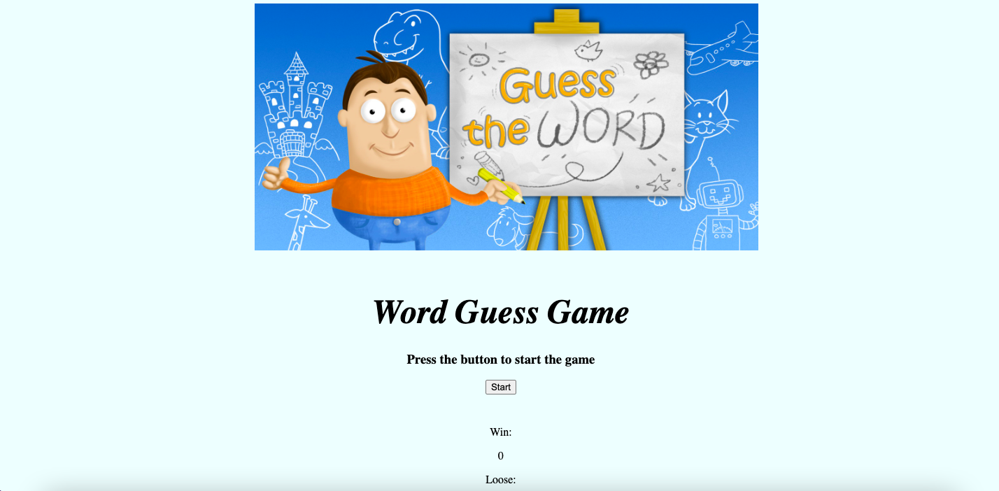

# Guessing-Word-Game
This project is a word guessing game in which user tries to guess the word by guessing different letters, correct letters then appears in the appropriate spaces of the word . A timer keeps track of the time the user has left. When the user correctly guesses the word, the user gets a "win" added to the score otherwise, the user gets a "losse" added to the score.

## Technology used
- HTML
- CSS
- Javascript

## Screenshots

## Deployment URL
https://17keerti.github.io/Guessing-Word-Game/